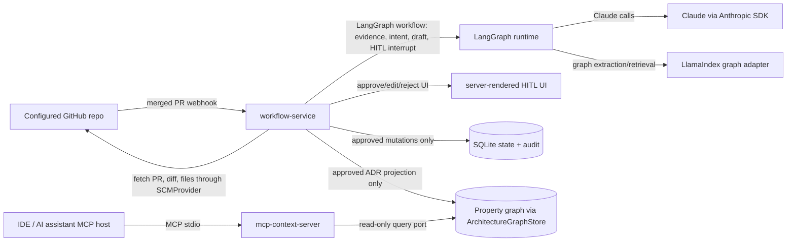

# Project Architecture: LivingADR

<!-- CRISPY Project Phase: INTENTION → produces architecture.md -->
<!-- System-of-record for tech stack, service boundaries, data, deployment. -->
<!-- Section anchors are STABLE — feature-level intent.md files will reference them by anchor. -->

| Field         | Value                                      |
|---------------|--------------------------------------------|
| **Project**   | LivingADR                                  |
| **Folder**    | `crispy-docs\projects\004-living-adr`     |
| **Date**      | 2026-05-25                                 |
| **Status**    | Draft                                      |
| **Vision**    | vision.md                                  |
| **Research**  | domain-research.md                         |

---

## 1. Architecture Summary

LivingADR should be a **hybrid, single-repository system with two deployable processes**: a GitHub-first workflow service that receives merged-PR events, runs the LangGraph + LlamaIndex + Claude pipeline, presents a server-rendered HITL review gate, and performs approved graph mutations; and a separate, read-only MCP context server that serves approved architecture rationale to IDEs and coding agents. This keeps PoC operations small enough for the 1-user / 1-repo pilot while isolating the IDE-facing trust boundary from the SCM-facing mutation boundary, preserving clean seams for Azure DevOps adapters and future Neo4j or other graph-store backings.

---

## 2. Architecture Options Considered

### Option A — Modular Monolith

- **Approach:** One Python service, one repo, one deploy unit. FastAPI hosts GitHub webhook ingestion, the LangGraph workflow, the HITL review UI, the graph adapter, and an in-process MCP server or MCP endpoint.
- **Pros:** Fastest PoC path; least operational overhead; easiest local debugging; aligns with the vision's single-user / single-repo PoC scale.
- **Cons:** Collapses the SCM mutation surface and IDE-facing MCP trust surface into one process; makes MCP auth/transport tradeoffs harder to isolate; increases blast radius if prompt/tool injection or local MCP trust failures occur; later service split would cut across UI, workflow, and context-delivery code.
- **Effort:** S
- **Risk:** Medium

### Option B — Decomposed Event-Driven Services

- **Approach:** Separate services for SCM webhook ingestion, event normalization, LangGraph workflow workers, HITL UI/API, graph/retrieval service, and MCP context delivery, connected by an event bus and shared state stores. This can be multiple repos or a workspace-style monorepo.
- **Pros:** Cleanest post-PoC scaling story; strongest independent ownership boundaries; event replay and backfill are natural; workflow, UI, and MCP server can scale and deploy independently.
- **Cons:** Over-engineered for the vision's 1-user / 1-personal-repo PoC; introduces queue operations, distributed idempotency, event ordering, and cross-service auth before the product has validated draft quality; increases the risk of spending the PoC proving infrastructure instead of ADR value.
- **Effort:** L
- **Risk:** High

### Option C — Hybrid Single Repo, Two Deployables

- **Approach:** One local repo, `living-adr`, with shared internal packages and two deployable processes: `workflow-service` for GitHub App webhooks, LangGraph orchestration, HITL backend/UI, audit state, and approved graph mutation; `mcp-context-server` for read-only MCP resources/tools over the approved architecture graph. Both deployables can run on one host for PoC and split later without a repo migration.
- **Pros:** Preserves PoC simplicity while isolating the highest-risk boundary called out by MCP prior art: local/IDE servers and transport-specific auth. Keeps GitHub ingestion on native GitHub App + webhook primitives instead of inventing an input MCP. Leaves Azure DevOps as an SCM adapter, not a topology rewrite. Lets the graph store remain behind an explicit internal port from day one.
- **Cons:** Slightly more initial structure than a monolith; requires a shared internal package contract between the workflow and MCP processes; two local processes must be started during development.
- **Effort:** M
- **Risk:** Low-to-Medium

### Recommendation

**Selected:** Option C — Hybrid Single Repo, Two Deployables

**Justification:** Choose Option C. The vision locks in LangGraph + LlamaIndex, Claude, GitHub-first integration, HITL review before authoritative context, and a swappable graph abstraction, while also saying the PoC is 1 user, 1 personal GitHub repo, and one deployment is acceptable. Domain research makes the same tradeoff clear: Reference F says stateful agent runtimes need explicit checkpoints and human gates; Reference H says SCM webhooks need idempotency, replay, and platform-specific adapters; Reference G and FM-15/FM-16 warn that MCP local-server trust and auth differ by transport; Reference E plus FM-08/FM-10 warn that property-graph extraction needs schema governance and validation. Option A is too co-mingled at the MCP trust boundary. Option B is too much distributed-system risk for a PoC whose success metrics are draft acceptance, latency, approved mutation control, and retrieval relevance. Option C is the smallest topology that still creates the right long-term seams.

**Assumption decisions grounded in the research:**

- **A-02 Dual-MCP topology:** Replace with **SCM adapter input + standalone output MCP**. GitHub App webhooks are the native input boundary; an input MCP adds trust/auth complexity without helping the merged-PR trigger.
- **A-03 Observability:** Commit to **LangSmith** for V1 because LangGraph observability/debugging is native. Keep telemetry emitted through a small observability wrapper so Phoenix/OpenTelemetry can be added later if evaluation needs broaden.
- **A-04 HITL approval gate:** Commit. No graph mutation or authoritative ADR publication happens before approve/edit approval, matching SM-05 and mitigating FM-13, FM-20, and FM-23.
- **A-05 Merged PR signal:** Commit as the PoC input, but treat model rationale as provisional. Store evidence, confidence, and rejection reasons because FM-06 and FM-19 warn against overtrusting inferred rationale or PR summaries.
- **A-06 One ADR representation:** Replace with **human Markdown ADR + machine graph projection**. The Markdown ADR is the reviewable record; the property graph is the queryable projection. Do not force one artifact to serve both audiences perfectly.
- **A-07/A-08 1-repo / 1-user personal-repo PoC:** Commit as the pilot boundary, but instrument it as a validation-limited slice. The architecture must support seed/replay fixtures because a personal repo may not naturally produce all three structural-change classes.

---

## 3. Tech Stack {#tech-stack}

Version pins below are concrete V1 scaffold choices. Python package versions were resolved from PyPI during architecture generation on 2026-05-25; the Claude model ID is from Anthropic's current model documentation.

| Layer | Choice | Version | Rationale |
|-------|--------|---------|-----------|
| Language(s) | Python | 3.12.x (`requires-python = ">=3.12,<3.13"`) | Best-supported ecosystem for LangGraph, LlamaIndex, Anthropic SDK, FastAPI, and MCP server packages. Pinning 3.12 avoids early-adopter runtime risk while staying modern. |
| Backend framework | FastAPI + Uvicorn | FastAPI 0.136.3; Uvicorn 0.48.0 | Minimal async HTTP surface for GitHub webhooks, HITL pages/actions, health checks, and local APIs. |
| Orchestration | LangGraph | 1.2.1 | Locked vision choice; supports stateful long-running workflows, interrupts/HITL, checkpointing, and LangSmith debugging. |
| Retrieval / graph | LlamaIndex PropertyGraphIndex behind `ArchitectureGraphStore` / `ArchitectureContextQuery` ports | llama-index 0.14.22 | Locked default graph implementation. The internal ports wrap LlamaIndex so a Neo4j, RDF, or other graph adapter can replace the backing without changing workflow or MCP code. |
| LLM | Claude via `anthropic` Python SDK; default model `claude-sonnet-4-6` | anthropic 0.104.1 | V1 locked LLM. Sonnet is the best speed/intelligence fit for structural-intent extraction and ADR drafting; model ID can change via config without changing SDK surface. |
| SCM integration | GitHub App + webhooks, implemented through an `SCMProvider` port with `GitHubProvider` adapter | httpx 0.28.1; PyJWT 2.13.0 | GitHub-first, fine-grained installation permissions, webhook delivery IDs, and short-lived installation tokens. Azure DevOps service hooks plug in later through the same port. |
| MCP server framework | Official Python `mcp` SDK; stdio transport for PoC output server | mcp 1.27.1 | Standards-based IDE/assistant integration. Standalone read-only server limits mutation risk and avoids mixing MCP transport auth with webhook auth. |
| HITL UI | Server-rendered FastAPI/Jinja2 HTML with progressive enhancement only if needed | Jinja2 3.1.6 | Smallest defensible PoC UI for approve/edit/reject with evidence. Avoids SPA framework cost before multi-user UX is validated. |
| Database / state | SQLite for PoC workflow state, HITL state, audit log, idempotency keys, and LangGraph checkpoint storage | Python 3.12 stdlib `sqlite3`; SQLAlchemy 2.0.50; aiosqlite 0.22.1 | Sufficient for 1 user / 1 repo. Post-PoC path is Postgres for state and optional Neo4j/other graph store through the graph port. |
| Graph persistence | LlamaIndex default property graph persistence under `var\graph` via the graph adapter | llama-index 0.14.22 | Keeps PoC local and swappable. The adapter owns persistence paths, schema versioning, and graph rebuild hooks. |
| Cache / queue | No external queue for PoC; SQLite-backed inbox/outbox and LangGraph checkpoints | n/a | Avoids distributed queue overhead. Idempotent event handling and replay tables mitigate webhook duplication/gaps. Post-PoC can add a broker behind an `EventBus` port. |
| Auth | GitHub webhook HMAC verification, GitHub App installation tokens, local single-user UI token, read-only local MCP process trust | PyJWT 2.13.0; python-dotenv 1.2.2 | Matches internal PoC risk. Avoids OAuth/user management until multi-reviewer rollout. Secrets come from environment or `.env.local`, never committed. |
| Observability | LangSmith through a thin `Observability` wrapper | langsmith 0.8.5 | Native LangGraph tracing/evals make it the opinionated V1 choice. Wrapper enables redaction and future Phoenix/OpenTelemetry export. |
| Build / package | uv + pyproject.toml workspace-style package layout | uv 0.11.16 | Fast, reproducible Python dependency management and lockfile. Supports local package entry points for both deployables. |
| Test framework | pytest | 9.0.3 | Standard Python testing with async support available when needed; validates workflow nodes, adapters, graph ports, and MCP tools. |
| Lint / format | Ruff | 0.15.14 | Single fast tool for lint/format in CI. Not a project capability, but scaffold should include it to keep generated code consistent. |
| CI / CD | GitHub Actions | n/a | Matches GitHub-first constraint. CI should run `uv sync --locked`, `uv run ruff check`, and `uv run pytest`. Pin action SHAs or current majors during scaffold. |
| Infra / hosting | Local two-process run for PoC; container-ready for post-PoC | n/a | PoC runs on a developer machine or one small internal host. Post-PoC default target should be Azure Container Apps or equivalent container hosting, but the architecture does not lock a cloud provider. |

**`crispy-scaffold` commands:**

```powershell
cd C:\repos
python -m pip install uv==0.11.16
uv init living-adr --package --python 3.12 --vcs git
cd C:\repos\living-adr
uv add fastapi==0.136.3 "uvicorn[standard]==0.48.0" langgraph==1.2.1 llama-index==0.14.22 anthropic==0.104.1 mcp==1.27.1 langsmith==0.8.5 sqlalchemy==2.0.50 aiosqlite==0.22.1 httpx==0.28.1 pyjwt==2.13.0 pydantic-settings==2.14.1 python-dotenv==1.2.2 jinja2==3.1.6
uv add --dev pytest==9.0.3 ruff==0.15.14
```

**Required local package layout for the single repo:**

```text
C:\repos\living-adr\
  pyproject.toml
  uv.lock
  src\living_adr\
    apps\workflow_service\
    apps\mcp_context_server\
    core\
    scm\
    graph\
    workflow\
    hitl\
    observability\
  tests\
  var\.gitkeep
```

**Required console entry points:**

- `living-adr-workflow` starts the FastAPI workflow/HITL service.
- `living-adr-mcp` starts the read-only MCP context server over stdio.

---

## 4. Repositories {#repositories}

| Repo name (kebab-case) | Purpose | Stack subset | Public deps | Notes |
|------------------------|---------|--------------|-------------|-------|
| `living-adr` | Single local repo containing shared core code plus two deployables: `workflow-service` and `mcp-context-server`. | Python 3.12, FastAPI/Uvicorn, LangGraph, LlamaIndex PropertyGraphIndex, Anthropic SDK, official MCP SDK, SQLite, LangSmith, pytest, Ruff, uv. | `fastapi`, `uvicorn`, `langgraph`, `llama-index`, `anthropic`, `mcp`, `langsmith`, `sqlalchemy`, `aiosqlite`, `httpx`, `pyjwt`, `pydantic-settings`, `python-dotenv`, `jinja2`, `pytest`, `ruff`. | Initialize as `C:\repos\living-adr`. Use internal packages for ports/adapters so future service extraction or repo split is mechanical, not architectural. |

---

## 5. Service Boundaries {#service-boundaries}



- **`workflow-service`:** Owns webhook receipt, signature verification, SCM event normalization, idempotency, LangGraph orchestration, Claude calls, HITL review state/UI, audit log, and approved graph mutations. It is the only process allowed to mutate authoritative ADR records or graph state.
- **`mcp-context-server`:** Owns IDE/assistant context delivery. It exposes read-only MCP resources/tools over stdio and depends only on `ArchitectureContextQuery`, not on mutation services, webhook handlers, or GitHub credentials.
- **`core`:** Owns domain types and ports, including `SCMProvider`, `ArchitectureGraphStore`, `ArchitectureContextQuery`, `ADRRecordRepository`, `ReviewRepository`, `AuditLog`, and `Observability`. Implementations live behind adapters.
- **`scm`:** Starts with `GitHubProvider` for GitHub App webhooks and REST calls. `AzureDevOpsProvider` is a post-PoC adapter that maps service hooks and PR APIs into the same normalized event model without changing workflow nodes.
- **`graph`:** Starts with `LlamaIndexPropertyGraphAdapter`. Future `Neo4jGraphAdapter` or RDF adapters must satisfy the same high-level read/write/query port and migration/rebuild contract.
- **Boundary rule:** Graph mutations are allowed only after an approved HITL decision. MCP can cite and retrieve approved context but cannot approve, edit, reject, fetch private SCM data, or mutate graph state.

---

## 6. Data Model (High-Level) {#data-model}

- **RepositoryConfig:** Install-time configuration for the GitHub repo, GitHub App installation, branch defaults, ADR path/export policy, and provider type. Designed so Azure DevOps can supply equivalent config later.
- **SCMEvent:** Normalized, idempotent event envelope for merged PRs and future SCM events. Includes provider identity, delivery identity, timestamps, and fetch handles, not provider-specific business logic.
- **ChangeEvidence:** Immutable evidence gathered from merged PR metadata, diff summaries, dependency/schema/API-contract signals, linked text, and retrieval context. Evidence is stored separately from inferred rationale.
- **DecisionCandidate:** Provisional ADR draft and classification output from the LangGraph workflow. It is never authoritative until a HITL decision approves or approves-after-edit.
- **ReviewDecision:** Human approve/edit/reject decision with rationale and audit trail. In the PoC, the same person may be PR author and reviewer, but the role distinction remains explicit.
- **ADRRecord:** Human-readable Markdown ADR plus structured metadata/projection. This is the canonical approved decision record for V1; the graph is a queryable projection, not the only source.
- **ArchitectureGraph:** Entities and relationships for ADRs, components, dependencies, schemas, API contracts, PRs, commits, supersession links, and evidence citations. The graph schema is versioned by the graph adapter.
- **QuerySession / RetrievalTrace:** Read-only MCP query metadata, retrieved context IDs, cited ADRs, and quality signals. Trace content must follow redaction rules before observability export.
- **AuditEvent:** Append-only record of webhook handling, model drafting, review decisions, graph mutations, MCP access summaries, and failed/retried operations.

---

## 7. Cross-Cutting Concerns {#cross-cutting}

- **Auth & authz:** Use GitHub webhook HMAC validation and minimum GitHub App permissions for ingestion. The PoC HITL UI uses a local single-user token. The MCP server is read-only and local stdio by default; HTTP MCP, OAuth, or enterprise identity are post-PoC concerns.
- **Logging / observability:** Use structured logs plus LangSmith traces for LangGraph workflow runs, model calls, retrieval, and tool calls. Redact secrets, diff hunks when configured, model prompts containing sensitive code, and personal identifiers before export.
- **Error handling:** All SCM events are idempotent by provider delivery ID and normalized PR key. Failed workflow steps remain replayable from stored evidence. Graph mutations are transactional and append audit events. Poison events stay in a SQLite dead-letter/outbox table for manual replay.
- **Configuration / secrets:** Configure repo target, GitHub App ID, private key path, webhook secret, Anthropic API key, LangSmith key, UI token, and storage paths through environment variables or `.env.local`. Scaffold must create `.env.example`, not real secrets.
- **Security:** Treat repository text, PR descriptions, and model outputs as untrusted input. Prompt-injection mitigations belong in workflow prompts, evidence delimiters, tool allowlists, and no-mutation-before-HITL enforcement. MCP exposes only read tools over approved ADR context.
- **Graph governance:** The graph adapter owns schema versioning, extraction provenance, validation, rebuild, and adapter conformance tests. No caller may depend on LlamaIndex internals directly.
- **Source-of-truth discipline:** Code and PR data are evidence; approved ADR records are authoritative rationale; graph nodes/edges are projections with citations back to ADR/evidence. Conflicts surface as review prompts or open questions, not silent overwrites.
- **Internationalization:** English-only PoC. Keep text generation and UI copy centralized so localization can be added later if needed.
- **Accessibility:** Server-rendered HITL UI must use semantic HTML forms, keyboard-accessible actions, visible focus states, and readable evidence citations. Avoid SPA-only interactions in V1.

---

## 8. Deployment & Environments {#deployment}

| Environment | Purpose | Hosting | Notes |
|-------------|---------|---------|-------|
| local | Development and default PoC run | Two local processes from `C:\repos\living-adr`: `living-adr-workflow` and `living-adr-mcp`; SQLite and graph files under `var\` | Requires configured GitHub App credentials and a user-provided webhook delivery path or replay fixture. MCP stdio runs from the local repo. |
| poc-internal | Optional shared PoC host for one reviewer and one repo | One small internal VM/container host or equivalent; both deployables co-located | Same topology as local. Use persistent volume for SQLite/graph state. Do not introduce external queue or managed graph database unless local PoC cannot meet latency/reliability metrics. |
| post-poc | Multi-repo / multi-reviewer hardening path | Containerized deployment such as Azure Container Apps, AWS Fargate, or equivalent; managed Postgres optional; Neo4j/other graph optional through adapter | Not locked for MVP. Split deployment scaling is available because workflow and MCP are already separate processes. Azure DevOps support arrives by adding an adapter, not by reshaping the system. |

---

## 9. Anti-Patterns to Avoid {#anti-patterns}

Pulled from `domain-research.md §7 Common Failure Modes`; these are the actionable inverses for LivingADR.

- **FM-01: ADR never created at decision time.** Do this instead: trigger candidate generation from merged PR events and keep a replayable event inbox so missed webhook deliveries can be recovered.
- **FM-02: ADR status rot.** Do this instead: model ADR status, supersession, and affected-entity relationships explicitly; never overwrite historical decisions destructively.
- **FM-03: Over-documentation and ADR fatigue.** Do this instead: keep the PoC threshold to new dependencies, schema changes, and API-contract changes until precision is measured.
- **FM-04: Pseudo-rationale and missing alternatives.** Do this instead: require drafts to show evidence, alternatives considered, and consequences before approval.
- **FM-05: Decision ownership loss.** Do this instead: store reviewer identity/role and decision provenance even when the PoC author and reviewer are the same person.
- **FM-06: After-the-fact hallucinated rationale.** Do this instead: label inferred rationale as provisional, cite concrete PR/diff evidence, and require HITL approval before graph mutation.
- **FM-07: Static graph blind spots.** Do this instead: treat code/diff structure as evidence, not complete truth; allow humans to add missing runtime/deployment context during review.
- **FM-08: Graph schema drift.** Do this instead: version the graph schema inside the graph adapter and test adapter behavior through stable ports.
- **FM-09: Embeddings retrieve similarity, not causality.** Do this instead: prefer graph relationships, citations, and approved ADR context for "why" answers; use embeddings only as a supporting retrieval signal.
- **FM-10: GraphRAG false edges and entity-resolution errors.** Do this instead: validate extracted entities/edges, retain provenance, and mutate the approved graph only after review.
- **FM-11: Low RAG faithfulness.** Do this instead: require MCP answers to cite approved ADRs/evidence and measure faithfulness in the evaluation harness.
- **FM-12: Retriever misses relevant context.** Do this instead: build a held-out query set and track context recall before expanding beyond PoC.
- **FM-13: Agent excessive agency.** Do this instead: keep all authoritative mutations behind deterministic workflow steps and human approval gates.
- **FM-14: Prompt/tool injection.** Do this instead: isolate untrusted repo text, delimit evidence, restrict tools, and never let model output directly execute actions.
- **FM-15: MCP local-server trust failure.** Do this instead: ship the MCP server as a small read-only process with documented tools/resources and no SCM or mutation credentials.
- **FM-16: MCP auth mismatch.** Do this instead: use stdio/local process trust for PoC and design HTTP/OAuth MCP as a separate post-PoC decision.
- **FM-17: SCM event duplication, gaps, and replay complexity.** Do this instead: store provider delivery IDs, normalize event keys, make handlers idempotent, and support manual replay.
- **FM-18: Rate-limit starvation during backfill.** Do this instead: fetch only the merged PR evidence needed for V1, cache fetched artifacts, and defer broad history mining.
- **FM-19: PR summary overtrust.** Do this instead: combine PR description, diff evidence, repository file context, and model analysis; never rely on generated summaries alone.
- **FM-20: HITL rubber-stamping and approval fatigue.** Do this instead: present concise evidence, confidence, alternatives, and edit/reject paths so approval remains meaningful.
- **FM-21: Sensitive data in traces.** Do this instead: redact secrets, personal data, prompts, code snippets, and retrieved context before LangSmith export unless explicitly allowed.
- **FM-22: Evaluation overfitting.** Do this instead: keep evaluation datasets versioned, include rejected/edge-case examples, and treat metric gains as regression signals, not proof of truth.
- **FM-23: Docs-as-code without review gates.** Do this instead: maintain review-gated approved ADR records and audit graph mutations; do not equate Markdown generation with accepted rationale.
- **FM-24: Cross-SCM abstraction leaks.** Do this instead: keep provider-specific event taxonomies and permissions inside SCM adapters and expose only normalized concepts to workflows.

---

## 10. Open Architectural Questions

- What exact GitHub App permissions and webhook events should be requested for PoC while preserving least privilege?
- How will local PoC webhook delivery be exposed: user-provided tunnel, internal relay, manual replay fixture, or a small hosted PoC endpoint?
- Which specific personal GitHub repo will be configured at startup, and does it contain or can it generate enough dependency/schema/API-contract changes to validate SM-01 and SM-02?
- What held-out query set and human scoring rubric define SM-03 retrieval relevance and SM-04 architecture question coverage?
- What confidence threshold and evidence bundle should distinguish "no ADR needed" from "draft ADR for review" for each structural-change class?
- What exact source-of-truth hierarchy applies when code, PR text, approved ADRs, graph projections, and model-inferred facts conflict?
- What temporal model is required for superseded ADRs, PRs, commits, releases, and graph snapshots before multi-repo rollout?
- Should approved ADR Markdown be exported back into the target GitHub repo during PoC, or remain in LivingADR state with post-PoC docs-as-code export?
- What LangSmith redaction, retention, sampling, and access policy is acceptable for source code, prompts, retrieved context, and review decisions?
- Should LangGraph checkpoint tables and application audit/HITL tables share one SQLite database with separate schemas, or be physically separated before post-PoC?
- What future HTTP MCP auth model is acceptable if the read-only context server moves from local stdio to remote/shared deployment?
- What normalized SCM event vocabulary is sufficient for Azure DevOps service hooks without leaking GitHub-only assumptions into workflow nodes?

---

## Reviewer Findings

<!-- Populated by orchestrator from spec-review + code-review at the architecture gate. -->
